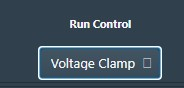
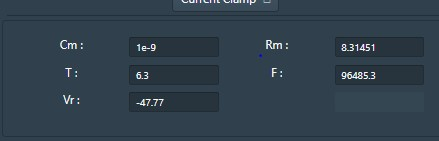
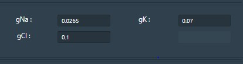
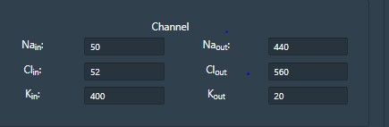
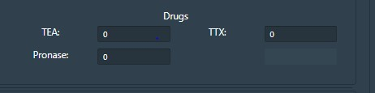
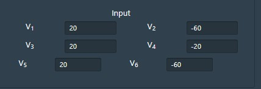
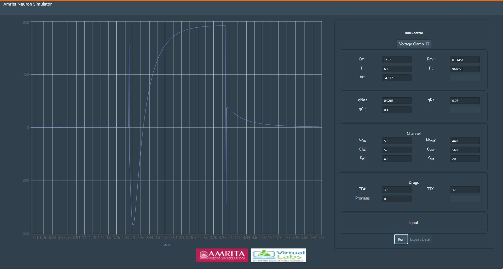

**Procedure to Work Simulator**
 

In this experiment, users can  study the contribution of Na+ and K+ currents (because of in flow and out of these ions) as major contribution to total current  generated by a nerve cell. Effect of drugs like TTX and TEA on these channels as pharmacological perspective. This exercise also help to understand how the parameters recorded from an voltage clamp experiment were used to formulate the kinetics of voltage activated ion channels responsible for excitation (Na+, K+, fast gates, slow gates, etc.)

&nbsp;

By default the simulator window will be in current clamp mode, for every reset the mode will reset to current clamp. For studying voltage clamp, access the voltage clamp mode by clicking the drop down list Run control menu and select Voltage clamp. 

&nbsp;

Understanding Simulator Parameters

Cm  = Membrane Capacitance (nF)

Rm  = Membrane resistance (MΩ)

Vr  = Resting Voltage (mV)

T = Temperature (0C)	

F= Frequency (Hz)

&nbsp;

gNa = Conductance of Sodium ions

gK= Conductance of Potassium ions

gCl= Conductance of Chloride ions

&nbsp;

Membrane window provides accesses to internal and external ionic concentration (Sodium, chloride and potassium) and membrane properties.

&nbsp;

&nbsp;

Drug window helps to study the pharmacological effect in neuronal membrane by the application of three drugs TTX (Inhibit Na current), TEA (Inhibit K current), Pronase (eliminate Na+ inactivation).Drugs can be applied at any point of time. 

&nbsp;

&nbsp;

Input parameters are different voltages applied to simulate HH neuron models for applied voltages. Voltage button give stimuli as voltage to the neuron.

&nbsp;
&nbsp;

Click on run button to execute simulator. 

&nbsp;

The resulting plot indicates the total ionic current in response to the applied voltage. 

&nbsp;

&nbsp;

To study the pharmacological activities using TTX and TEA on voltage clamp, user can provide specific drug concentration in the boxes. For example give 30% concentration of TEA and 17% concentration of TTX. Observe the change in the total current plotted. 

&nbsp;

&nbsp;

Tetrodotoxin(TTX) blocks action potentials in nerves by binding to the voltage-gated, fast sodium channels in nerve cell membranes, essentially preventing any affected nerve cells from firing by blocking the channels used in the process. The effect of TTX drug can be simulated in Hodgkin and Huxley neuron by altering the conductance of sodium channels.

&nbsp;

Tetraethylammonium TEA, a potassium ion channel blocker. TEA is used in neurophysiological experiments to study potassium channels. The effect of TEA drug can be simulated in Hodgkin and Huxley neuron by altering the conductance of potassium channels.

&nbsp;

Pronase selectively destroys inactivation of the Na conductance (g(Na)).

&nbsp;

Users can provide different drug concentration values and can observe and understand the effect of drugs in voltage gated ion channels.

