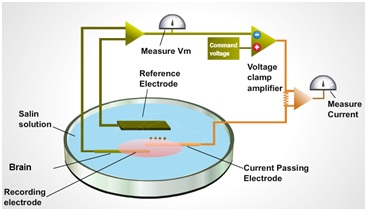
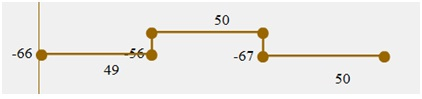
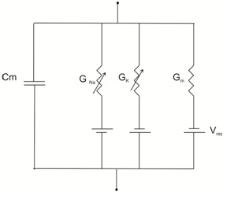
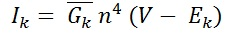
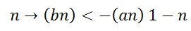
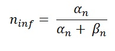
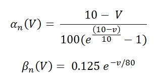
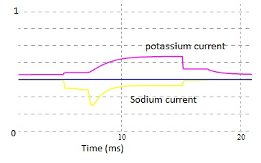

Classical neurophysiology studies of action potential leads to the important ionic hypothesis. The ideas and the concepts proved early days gave a strong basis for the development of experimental procedure called as Voltage Clamp technique by (Marmount, 1949; Cole, 1949; Hodgkin, Huxely and Kartz 1949,1952). The Voltage clamp has had been used as the best biophysical technique for the last few decades. Voltage clamp protocol can be used to study a minute patch of neuronal membrane sealed to the end of glass pipette by measuring the current. This method was the best basic biophysical technique used for studying the ion channels. Most of the classical electrophysiology work uses the protocol that, the current applied as a stimulus and measure the changes in the membrane potential. These applied current flow locally across the membrane as ionic and capacitive current. But in voltage clamp protocol reverses the process. For voltage clamp protocol study the membrane potential has to be keeping constant. Measuring the current by holding the membrane voltage constant for sometime then releases the membrane resting voltage. The advantage of this technique is, it can minimize the local spread of local circuit current, so that the observed current can be a direct measure of ionic movement across the membrane.

One might keep the membrane potential constant by connecting to an ideal battery across the bilipid membrane. The current would flow from the battery will be an exactly the current flowing across the membrane. This will keep the membrane potential constant. But an unpredictable voltage drop makes the circuit more complex. By adding another electrode near the   measuring electrode clamp with a feedback amplifier resolved this problem.
 

 
&nbsp;

 
 

Fig 1. The schematic arrangements for voltage clamping cell membrane .

The voltage clamp apparatus consists of a Feedback Amplifier, a Voltage Amplifier, and an Ammeter. The Voltage Amplifier is connected to a Voltage Electrode implanted inside the neuronal membrane, and to the Feedback Amplifier. The Feedback Amplifier is connected to a Current Electrode (C. E.). Finally, a Ground Electrode completes the feedback and voltage circuits through an ammeter to ground. The Voltage Amplifier is responsible for monitoring the membrane potential, Vm, and transmitting its value to the Feedback Amplifier. The Feedback Amplifier is responsible for maintaining Vm at the value desired by the experimenter. The ammeter displays the magnitude and direction of current flow through the membrane (Im).

In a standard voltage clamp protocol the membrane potential is stepped from resting potential to a holding potential usually 10mV increment from Vr then stepped back to resting potential.  Through a graphical interface we gave the flexibility to the user to change the test, command and resting voltage (see fig 2). One might change these parameters by clicking and dragging on the brown spheres at the edges of the square wave to either of 4-directions according to student interest.
 

 
&nbsp;

 
Fig 2. Voltage clamp stimuli in milli volts.

Hodgkin and Huxley carried out the study towards the mechanism behind membrane potential in the giant axon of a squid. The diameter of the axon was around 0.5 milli meter. They had inserted a highly conductive axial wire inside the axon (this technique also called space clamp). This technique along with pharmacological application brought Hodgkin and Huxley to study membrane current into constituent’s components.

In a standard voltage clamp experiment, the membrane potential is holds for few milli second to depolarize level and then holds back to previous potential. This process is called as step the membrane potential. This change in membrane potential will produce a charge difference between the inside and outside of the membrane, which will further result in ionic movement across the membrane, till the voltage gets hold back. The measured membrane current Im would be the sum of Ii and Ic (see fig 5).
 

 
&nbsp;

 
                                                                                             Eq (1 and 2)

Where Ii is the current carried by ions across the membrane, Ic is the capacitive current, dE/dt is the change in membrane potential, Cm is the membrane capacitance. Step changes in the membrane potential will measure only Ionic current, because of transition from one level to another, thus resulting in the change in membrane potential to zero.

Two major components of action potentials are voltage dependent ionic conductance of sodium (GNa) and  potassium (GK).And a third one is called leak conductance.
 

 
&nbsp;

 
                                                                                  Eq (3)

The individual ionic currents are linearly related to the driving potential. G ̅Na and G ̅K  are the maximum conductance of sodium and potassium.
 

 
&nbsp;

 

 Fig 3. Electrical equivalent circuit for a patch of a squid axon.

In HH model of squid axon consists of four parallel branches, two passive: membrane capacitance and leak conductance; and two time dependent voltage gated Na+ and K+. The ionic current flowing across the membrane is measured quantitatively first time using the voltage clamp technique. Followed by two main observations put forward by Hodgkin and Huxley was that, 1) the currents carried by Na+ ions should be inward at potentials negative to equilibrium potential ENa and out ward at potential positive to ENa. The same logic was applied to other ions.2) particular ion was added or removed from the medium resulted in some signals were abolished. In 1952 Hodgkin and Huxley formulated an Independent relation that the probability of an ion cross the membrane does not depend upon the other ions.

The step changes in the potential have significant advantage in measuring ionic current (Ii) except at the moment of transition occur from one state to another, the capacitive current Ic stops flowing as soon as a small step change in membrane potential. There after the recorded current is ionic current (Ii) (see fig. 2, 3 and 6).
 
 **Major components of ionic currents are INa and IK**

The movement of sodium and potassium ions in and out of the membrane create outward membrane current as positive deflection(IK) and inward membrane current as negative deflection(INa) (see fig 4).
 

 
&nbsp;

 

 Fig 4 . Measuring Na+ and K+ current from a voltage clamp setup
 

**Activation and inactivation states**

Hodgkin and Huxley discussed about the activation and inactivation of gating particles to describe the dynamics of conductance (see fig 6). These gating particles can either of two possible state open/close. Here we are answering the question how these activation and inactivation states determine the ionic currents.
 
 
&nbsp;

 

Fig 5. Red trace indicates the estimated total ionic current and voltage stimulus is indicated by blue trace.

**Potassium current IK**

In 1952 Hodgkin and Huxley modeled K+ current as:
 

 
&nbsp;

 
                                                              Eq (4)

 Maximum  conductance of K+ channels, (G¯K )   = 36 mS/cm2

Reverse potential of potassium,  EK = -12 mV.

'n' is the state of activation particle, this activation variable is dimension less and its value range between 0 and 1. IK is considered as outward current always positive for V > EK. Probability of finding one activation in its open state is n, and then n-1 will be the probability of finding an activation particle when gate is closed. Eq (6) states that in order to a K+ channels is changed to open state, four particles should be present. If we assuming these particles only have two states then the transition between the states will be governed by first order differential equation.
 

 
&nbsp;

 
                                                                     Eq (5)

αn is represent the voltage dependent rate constant (usually expressed in units of 1/second) it will specify how many transition occurs between the closed to open state.  βn is represent the number of transition occurs open to close status. The above equation can be written as a first order differential equation.
 

 
&nbsp;

 
                                                                          Eq (6)

The most demanding part of Hodgkin and Huxley study was the quantitative description of rate constants. αn  and βn can be express in terms of voltage dependent time constant tn(V).
 

 
&nbsp;

 
                                                                           Eq (7)

where
 
 
&nbsp;

           

 
&nbsp;

 
                                                                      Eq (8)

Steepness of relation between conductance and membrane potential as one of the most striking properties of squid membrane. Hodgkin and Huxley approximated the voltage depended of rate constant by :

 

 
&nbsp;

 

                                                                                    Eq (9 and 10)

V represents membrane potential expressed in milli volts (mV).
 
 
&nbsp;

 

Fig 6. Voltage dependent gating particles. As a function of membrane potential V, m represent sodium channel activation variable, h represent sodium channel inactivation variable, n represent the potassium channel inactivation variable.

 
 
&nbsp;

 

 

 
Fig 7. Estimated ionic currents, yellow trace indicate the sodium current (down ward) and magenta trace indicate the potassium current (upward).
 

 
**Sodium current INa**

The current of produced by sodium channel is given by :

 
&nbsp;

 
                                                                               Eq (11)

Maximum sodium channel conductance is given by , G ̅Na = 120 mS/cm2 and sodium reversal potential, ENa = 115mV. m and h are dimension less variables who's values ranges from 0 to 1 (see fig 7). By convention , the Na+ current is taken as negative. The amplitude of Na+ current is for 4-gating particle , will make an independent first order transition between open and closed states. Temporal changes of these particles governed by two first order differential equation.

 

 
&nbsp;

 

                                                                                                          Eq (12 and 13)

 
&nbsp;

 

                                                                                                                   Eq (14,15,16 and 17)
